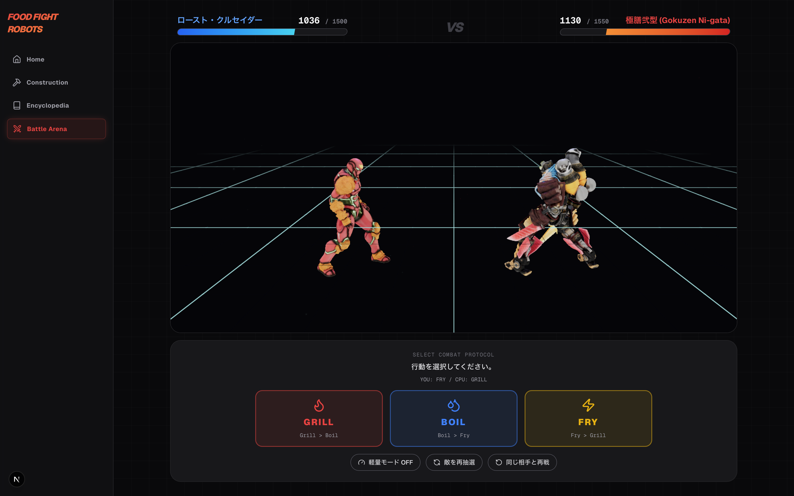

# Food Fight Robots



食べ物画像から「戦闘ロボット」を生成し、図鑑で管理してバトルできるデスクトップアプリです。  
フロントエンドは Next.js、ローカル実行とファイル保存は Tauri + Rust で構成しています。

## 主な機能

- 食べ物画像を入力してロボット設定（Name / Lore / HP / ATK / DEF）を生成
- コンセプト画像生成
- 3Dモデル生成（Meshy API）
- 図鑑表示（ローカルDB保存）
- バトル画面でのアニメーション再生
- Rigging/Animation 失敗時の静的モデルフォールバック

## 技術スタック

- Frontend: Next.js 16, React 19, TypeScript, Tailwind CSS
- 3D: three.js, @react-three/fiber, @react-three/drei
- Desktop/Backend: Tauri v2, Rust
- Storage: SQLite (Tauri app data dir)
- External APIs: Gemini API, Meshy API

## セットアップ

### 1. 前提環境

- Node.js (推奨: 20+)
- npm
- Rust (stable)
- Tauri v2 のビルド要件

### 2. 依存インストール

```bash
npm install
```

### 3. 環境変数

プロジェクトルートに `.env` を作成し、以下を設定してください。

```env
GEMINI_API_KEY=your_gemini_api_key
MESHY_AI_API_KEY=your_meshy_api_key
```

## 実行方法

Tauri 統合での実行（推奨）:

```bash
npm run tauri dev
```

Next.js 単体開発サーバー:

```bash
npm run dev
```

本番ビルド:

```bash
npm run build
```

## パイプライン概要

1. 画像アップロード
2. Gemini でステータスと外観プロンプト生成
3. Gemini でコンセプト画像生成
4. Meshy で Image-to-3D
5. Rigging + Animation（Idle/Attack）を試行
6. 失敗時は Base GLB にフォールバック
7. DB に保存して図鑑・バトルで利用

## データ保存先

- SQLite: アプリデータディレクトリ配下の `robots.db`
- 生成画像 / GLB: 同じくアプリデータディレクトリ配下

